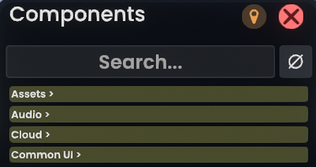

# 🍃🍒 CherryPick: For all your component picking needs!

CherryPick is a no-nonsense, straight-to-the-point component searcher mod for [Resonite](https://resonite.com) via [ResoniteModLoader](https://github.com/resonite-modding-group/ResoniteModLoader).

With CherryPick, your component browser gains a new element at the top: a search bar!

Simply start typing the name of the component you're looking for and the top ten results will appear immediately!

CherryPick also supports generic typing as well! You can insert generic arguments for the first generic type in the list like so:

